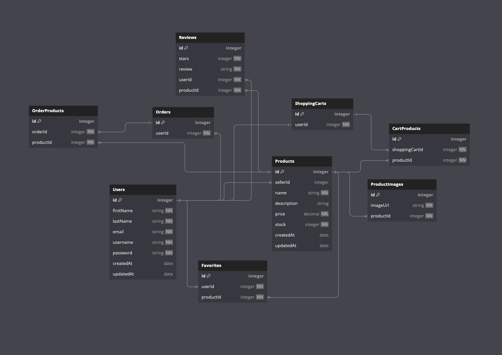

# Etsy Group Project

## Database Schema


## dbDiagram.io Schema
```
Table Users {
  id integer [primary key, increment]
  firstName string [not null]
  lastName string [not null]
  email string [not null]
  username string [not null]
  password string [not null]
  createdAt date 
  updatedAt date 
}

Table Products {
  id integer [primary key, increment]
  sellerId integer
  name string [not null]
  description string
  price decimal [not null]
  stock integer [not null]
  createdAt date 
  updatedAt date
}

Table ProductImages {
  id integer [primary key, increment]
  imageUrl string [not null]
  productId integer [not null]
}

Table ShoppingCarts {
  id integer [primary key, increment]
  userId integer [not null]
}

Table CartProducts {
  id integer [primary key, increment]
  shoppingCartId integer [not null]
  productId integer [not null]
}

Table Reviews {
  id integer [primary key, increment]
  stars integer [not null]
  review string [not null]
  userId integer [not null]
  productId integer [not null]
}

Table Favorites {
  id integer [primary key, increment]
  userId integer [not null]
  productId integer [not null]
}

Table Orders {
  id integer [primary key, increment]
  userId integer [not null]
}

Table OrderProducts {
  id integer [primary key, increment]
  orderId integer [not null]
  productId integer [not null]
}

Ref: "Users"."id" < "Products"."sellerId"

Ref: "Users"."id" - "ShoppingCarts"."userId"

Ref: "Products"."id" < "CartProducts"."productId"

Ref: "ShoppingCarts"."id" < "CartProducts"."shoppingCartId"

Ref: "Products"."id" < "Reviews"."productId"

Ref: "Users"."id" < "Reviews"."userId"

Ref: "Users"."id" < "Favorites"."userId"

Ref: "Products"."id" < "Favorites"."productId"

Ref: "Users"."id" < "Orders"."userId"

Ref: "Products"."id" < "OrderProducts"."productId"

Ref: "Orders"."id" < "OrderProducts"."orderId"

Ref: "Products"."id" < "ProductImages"."productId"
```